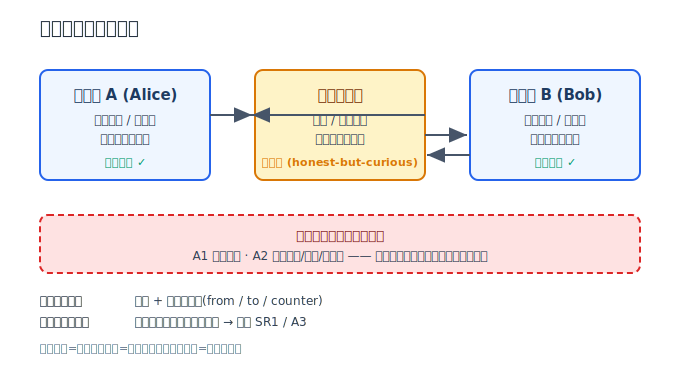
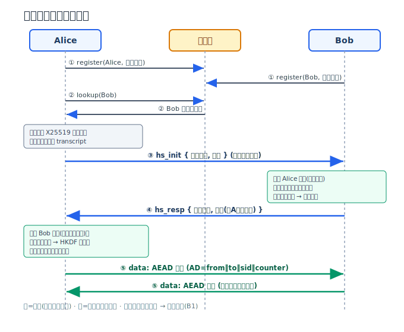
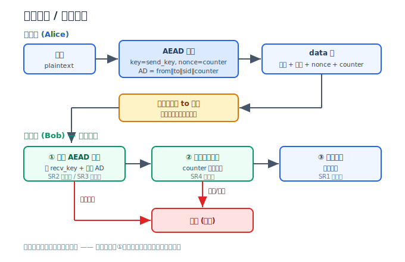

# 端到端加密一对一消息系统 —— 小组报告（中文版）

**课程**：COMP 5355 Cyber and Internet Security 2025/2026
**任务**：Task 1 — 端到端加密（E2EE）消息系统
**日期**：2026 年 6 月

---

## 1. 引言与任务范围

本项目设计并实现了一个端到端加密的一对一文本消息系统。明文仅存在于两个通信端点；中继服务器与底层网络只处理密文以及路由所需的元数据。系统实现了任务要求的全部三项必需功能：

- **(a) 用户注册与密钥生成**：每个用户在本地生成长期身份密钥对，并向服务器发布身份公钥。
- **(b) 认证密钥交换与会话建立**：双方通过带签名的临时密钥交换建立会话。
- **(c) 收发文本消息**：满足机密性、完整性、真实性与防重放（SR1–SR4）。

此外，系统在设计上还覆盖了两项 Bonus：**B1 前向保密**（每会话临时密钥）与 **B2 恶意服务器抵抗**（带外安全号比对）。

---

## 2. 系统设计与威胁模型（评分标准一）

### 2.1 系统架构

系统由三个实体组成：发送端（客户端 A）、接收端（客户端 B）、中继服务器。



- **客户端（唯一信任锚）**：生成并保管密钥、加解密消息、验证消息合法性。明文与会话密钥永不离开客户端。
- **中继服务器（弱信任）**：提供注册、公钥分发、按路由转发三项服务。它能读取所经手的一切，但其所见仅限密文与路由元数据。
- **网络（完全不可信）**：不提供任何机密性、完整性或真实性，所有安全属性必须由端点以密码学手段建立。

### 2.2 信任边界与假设

| 组件 | 信任级别 | 说明 |
|---|---|---|
| 端点 | 完全信任 | 正确执行协议，妥善保管长期与会话密钥（基础模型下端点不被攻陷） |
| 服务器 | 弱信任（honest-but-curious, A3） | 忠实执行协议但会记录所见的一切；设计须保证其学不到明文 |
| 网络 | 不信任（A1/A2） | 链路被对手完全控制 |
| 密码学原语 | 信任 | 标准原语（Ed25519、X25519、HKDF、ChaCha20-Poly1305）假定安全 |

**关于公钥分发的假设**：服务器存储并分发用户身份公钥。基础模型下服务器是 honest-but-curious，会分发正确的公钥；但客户端与服务器之间的信道仍可能被主动网络攻击者（A2）操纵。我们**不依赖 TLS** 等传输层机制来保证此信道——握手中的身份签名使得即便公钥在传输中被替换，验签也会失败（详见 §4）。

### 2.3 威胁模型（对手分类）

| 编号 | 对手 | 能力 |
|---|---|---|
| A1 | 被动网络攻击者 | 观察并记录全部传输数据（密文、时序、大小、收发地址） |
| A2 | 主动网络攻击者 | A1 全部能力 + 修改/丢弃/延迟/重排/重放/注入，并可在握手时尝试中间人 |
| A3 | honest-but-curious 服务器 | 忠实执行协议，但对存储与转发的一切有完全读取权限 |
| A4*（Bonus） | 瞬时端点泄露 | 某一时刻读取一台设备的秘密状态（含长期私钥），随后失去访问 |
| A5*（Bonus） | 恶意服务器 | A3 + 不必遵守协议：可篡改/丢弃/注入数据，可分发假公钥实施中间人 |

### 2.4 安全要求

| 编号 | 要求 | 含义 |
|---|---|---|
| SR1 | 机密性 | 仅授权用户能访问明文；被动观察者/服务器至多学到密文长度等显式允许的泄漏 |
| SR2 | 完整性 | 任何对密文的修改/替换/伪造都被接收方以压倒性概率检测并拒绝 |
| SR3 | 消息与发送者真实性 | 接收方能验证消息确实来自所声称的发送者，未被第三方伪造或注入 |
| SR4 | 防重放 | 攻击者重发截获的合法消息无法产生重复效果 |
| SR5*（Bonus） | 前向保密 | 长期私钥泄露不危及过去会话的机密性 |
| SR6*（Bonus） | 恶意服务器抵抗 | 服务器停止遵守协议时，完整性（SR2）仍成立 |

### 2.5 明确的范围外

- **可用性**：无限期丢弃/延迟流量的攻击者（拒绝服务）不在范围内。
- **持久端点攻陷**：攻击者持续控制使用中的设备不在范围内（A4 仅为一次性泄露）。
- **元数据隐私**：路由所需的收发方身份、消息大小、时序对服务器可见，本系统不隐藏（属显式允许泄漏）。
- **客户端-服务器认证**：按任务说明保持简单（首次注册即绑定连接），不是本项目重点。

---

## 3. 协议与密钥生命周期（评分标准二）

### 3.1 密钥类型

| 密钥 | 算法 | 生命周期 | 用途 |
|---|---|---|---|
| 长期身份密钥 | Ed25519 | 注册时生成，本地长期保存 | 对握手 transcript 签名，确立身份 |
| 临时密钥 | X25519 | 每次会话生成，握手后即弃 | 密钥协商（提供前向保密） |
| 会话方向密钥 | HKDF-SHA256 派生 | 会话期间 | AEAD 加解密（每方向一把） |

身份私钥以 32 字节原始形式存于本地 keystore（`0600` 权限，`.gitignore` 排除），永不上传服务器。

### 3.2 认证握手与消息流



**握手步骤**（发起方 = 主动发起聊天者，响应方 = 对端）：

1. **注册/查询**：双方各自注册身份公钥；发起方向服务器查询对端身份公钥。
2. **hs_init**：发起方生成临时 X25519 密钥对，用身份私钥对 transcript 签名后发送。
   - 签名材料 `T_init = 域标签‖session_id‖发起方身份公钥‖响应方身份公钥‖发起方临时公钥`
3. **hs_resp**：响应方先用查得的发起方身份公钥**验签**（失败立即拒绝），再生成自己的临时密钥对并签名回复。
   - 签名材料 `T_resp = 域标签‖session_id‖响应方身份公钥‖发起方身份公钥‖发起方临时公钥‖响应方临时公钥`
   - **响应签名覆盖了发起方的临时公钥**，把整个握手绑死，防止反射/重放。
4. **派生会话密钥**：双方计算 X25519 共享秘密，经 HKDF-SHA256 派生两把方向密钥：
   - `salt = 发起方临时公钥 ‖ 响应方临时公钥`
   - `k_i2r = HKDF(共享秘密, salt, info="...|i2r")`，`k_r2i = HKDF(共享秘密, salt, info="...|r2i")`
   - 发起方用 `k_i2r` 发、`k_r2i` 收；响应方相反。
5. **收发消息**：用方向密钥进行 AEAD 加密。

> transcript 采用**长度前缀拼接**（每段前置 4 字节长度），消除字段边界歧义；两条 transcript 各带不同**域标签**（`comp5355-hs-init-v1` / `-resp-v1`），防止跨消息混淆。

### 3.3 报文格式

采用 UTF-8 JSON，二进制字段用 base64 编码。每类报文均带 `type` 与 `version`：

```
register       { type, version, username, identity_pub }
lookup         { type, version, username }
lookup_result  { type, version, username, identity_pub | found:false }
hs_init        { type, version, from, to, session_id, eph_pub, signature }
hs_resp        { type, version, from, to, session_id, eph_pub, signature }
data           { type, version, from, to, session_id, counter, nonce, ciphertext }
error          { type, version, reason, ref? }   # 服务器控制/诊断消息
```

服务器只读取 `from`/`to` 路由字段；`eph_pub`、`signature`、`nonce`、`ciphertext` 对服务器不透明。

### 3.4 消息加密与解密流程



**发送**：
- `counter ← 会话发送计数器（单调递增）`
- `nonce ← counter`（12 字节大端，每方向独立密钥 → nonce 永不重用）
- `AD ← from‖to‖session_id‖counter`（以 `0x1f` 分隔，防拼接歧义）
- `ciphertext ← ChaCha20-Poly1305(send_key, nonce, plaintext, AD)`

**接收（顺序严格）**：
1. **路由检查**：`session_id`、`from`/`to` 必须匹配本会话。
2. **AEAD 验签解密**：用 `recv_key` 与**重建的 AD** 验证标签——失败即拒（SR2/SR3）。
3. **重放窗口检查**：counter 经滑动位图窗口（窗口大小 64）检验——重复或越窗即拒（SR4）。

> **关键顺序**：先验 AEAD 标签，后更新重放窗口。若顺序相反，攻击者发一个高 counter 的伪造帧即可污染窗口、让后续合法消息被误拒。本实现通过此顺序避免该问题（见测试 `test_forged_counter_does_not_poison_window`）。

### 3.5 密钥生命周期总结

- **生成**：身份密钥与临时密钥均用库 CSPRNG（`os.urandom`）生成。
- **分发**：身份公钥经服务器分发；临时公钥在握手报文中交换。
- **派生**：会话密钥由 X25519 共享秘密经 HKDF-SHA256 派生，绝不直接使用原始共享秘密。
- **销毁**：会话结束后丢弃临时密钥与会话密钥——这是前向保密（B1）的基础。

---

## 4. 逐攻击者防御论证（评分标准三）

| 对手 | 攻击手段 | 防御机制 | 满足要求 | 残余局限 |
|---|---|---|---|---|
| **A1 被动** | 监听密文 | ChaCha20-Poly1305 加密 | SR1 | 泄漏密文长度、收发方、时序（显式允许） |
| **A2 主动** | 篡改密文 | Poly1305 认证标签 | SR2 | — |
| **A2 主动** | 伪造/注入消息 | 无会话密钥无法生成有效标签 | SR3 | — |
| **A2 主动** | 中间人（握手期） | 身份私钥签名握手 + 验签 | SR3 | 依赖公钥分发可信（A5 下需带外比对） |
| **A2 主动** | 重放 | 计数器 + 滑动窗口 + AD 绑定 counter | SR4 | — |
| **A2 主动** | 错投递/跨会话重用 | AD 绑定 `from‖to‖session_id` | SR2/SR3 | — |
| **A3 服务器** | 偷窥存储/转发内容 | 端到端加密，服务器无会话密钥 | SR1 | 可见路由元数据 |

**A1 论证**：消息体始终以 AEAD 加密形式出现在链路上。被动攻击者记录到的只有密文，无法在不掌握会话密钥的情况下恢复任何明文信息。→ SR1。

**A2 论证**：
- *篡改*：任何对密文位的改动都会使 Poly1305 标签校验失败，接收方拒绝。→ SR2。
- *伪造/注入*：标签由会话密钥保护，攻击者无密钥则无法构造能通过校验的帧。→ SR3。
- *中间人*：握手材料由长期身份私钥签名，且签名同时覆盖**双方身份公钥**（防身份误绑定/未知密钥共享）。攻击者无身份私钥无法伪造合法握手。即便它替换响应方临时公钥，发起方验签也会失败（测试 `test_initiator_rejects_swapped_ephemeral_key`）。→ SR3。
- *重放*：每条消息携带单调计数器，计数器又被绑入 AD；接收方以滑动窗口拒绝重复或越窗的计数器。→ SR4。

**A3 论证**：服务器只转发不解密（测试 `test_data_forwarded_to_recipient_unchanged` 证明密文原样转发）。它既无会话密钥也无临时私钥，故无法解密任何消息体。→ SR1。

---

## 5. 密码学正确性（评分标准二要点）

- **全部原语来自 vetted 库**：使用 Python `cryptography` 包（Ed25519、X25519、HKDF-SHA256、ChaCha20-Poly1305），未自实现任何密码学原语。
- **随机数**：密钥与一切随机量均来自库 CSPRNG（`os.urandom`）。
- **nonce 不重用**：nonce 由方向内单调计数器派生，且收发两方向使用**不同密钥**，确保 `(key, nonce)` 对永不重复。
- **共享秘密不直用**：X25519 原始输出一律经 HKDF 派生，`info` 标签绑定协议用途与方向。
- **无明文密钥上链**：网络上不出现任何私钥/会话密钥；身份私钥仅存本地。

---

## 6. 实现与代码结构（评分标准四）

```
crypto/     原语薄封装（primitives.py：签名/ECDH/HKDF/AEAD；fingerprint.py：安全号）
protocol/   报文格式与校验（messages.py）、常量（constants.py）
client/     身份(identity) / 握手(handshake) / 会话与重放(session)
            / 消息收发(messaging) / 传输(transport) / 命令行(cli)
server/     注册(registry) / 路由(relay) / 持久化(storage) / 入口(app)
tests/      68 个单元与集成测试
demo/       脚本化双客户端演示(run_demo.py)
```

**运行**：

```bash
python -m server.app                 # 启动中继服务器
python -m client.cli chat --user alice
python -m client.cli chat --user bob
# 在 alice 端输入 /chat bob 完成握手后即可发送消息
```

**测试**：`python -m pytest tests/ -q` —— 全部 68 项通过，其中 `test_integration.py` 启动真实服务器 + 两个真实 WebSocket 客户端跑完整流程。

---

## 7. Bonus 扩展

### 7.1 B1 前向保密（对抗 A4）

每次会话都生成**全新的临时 X25519 密钥对**，会话结束即销毁。会话密钥由临时密钥的共享秘密派生，与长期身份密钥无关。因此即使攻击者日后窃取了长期身份私钥，也无法重算任何过去会话的共享秘密，已记录的历史密文仍不可解。

> 验证：`test_fresh_sessions_have_independent_keys` 证明相同身份的两次握手得到完全不同的会话密钥。

### 7.2 B2 恶意服务器抵抗（对抗 A5）

- **完整性仍成立**：所有应用消息由端到端 AEAD 保护。恶意服务器若篡改/注入密文，接收方标签校验失败而拒绝（SR2 不依赖服务器诚实）。重排/重放被计数器与窗口拒绝。
- **假公钥检测**：恶意服务器可在查询时分发假身份公钥实施中间人。系统提供**安全号（safety number）**：对双方身份公钥排序后哈希得到与顺序无关的可读数字串（`crypto/fingerprint.py`）。双方带外比对，若一致即可确认无中间人。
- **附加防线**：服务器端注册逻辑拒绝以不同公钥覆盖已注册用户名（`REGISTER_CONFLICT`），增加静默换钥难度。

> **局限**：安全号需用户手动带外比对；本系统未实现持久化的 TOFU（首次信任）信任库，故对从未比对过安全号的首次会话，恶意服务器的中间人在比对前不可自动检测。此为部分实现，按 Bonus 规则可获部分分。

---

## 8. 局限与诚实声明

- 身份私钥在磁盘上**未加密存储**（基础模型假定端点不被攻陷）。生产系统应以口令派生密钥加封。
- 不防护流量分析（消息大小/时序/收发方对服务器可见）。
- 客户端-服务器认证刻意从简（注册即绑定），非本项目重点。
- B2 的假公钥检测依赖用户带外比对，非全自动。

---

## 9. 测试与验证小结

| 测试文件 | 项数 | 覆盖 |
|---|---|---|
| test_primitives.py | 16 | 原语正确性、密文拒绝、序列化、安全号 |
| test_messages.py | 13 | 报文往返、AD 防歧义、畸形帧拒绝 |
| test_handshake.py | 9 | 密钥一致、伪造/换钥拒绝、前向保密 |
| test_replay.py | 9 | 计数器单调、窗口边界、重放拒绝 |
| test_messaging.py | 12 | 端到端往返、篡改/伪造/重放拒绝 |
| test_server.py | 8 | 注册/查询/路由、密文原样转发、换钥拒绝 |
| test_integration.py | 1 | 真实 WebSocket 全栈双客户端流程 |
| **合计** | **68** | 全部通过 |
